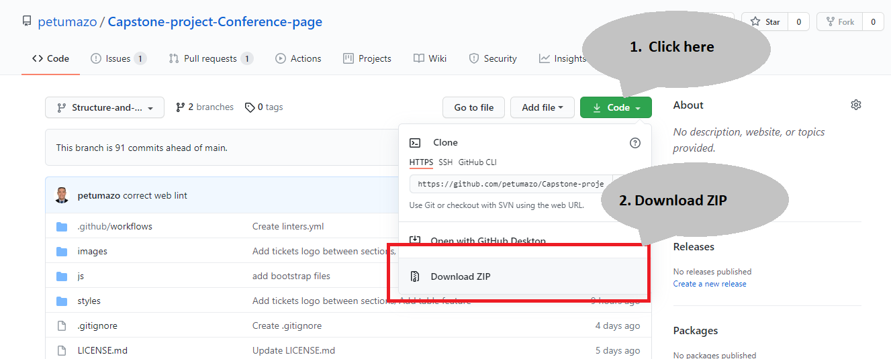

# HTML-CSS-capstone-project: Conference-page

This project is a website with main, about, and tickets pages for a spiritual journey to Mount Kailash in Nepal with the famous and international Yogi Sadhguru Jaggi Vasudev.

## Built With

- HTML
- CSS

## Live Demo

[Live Demo Link](https://petumazo.github.io/Capstone-project-Conference-page/)

## Getting Started

To get a local copy up and running follow these simple steps.

### Prerequisites

-Web browser

### Setup

-Download/Clone the repository files and navigate to index.html

### Instructions
-You can clone the repo by using this commands on your terminal: 
> - `git clone https://github.com/petumazo/Capstone-project-Conference-page.git`.
> - `cd Capstone-project-Conference-page`.

-You can also download this repo as a ZIP file following this instructions:
>

## Authors

👤 **David Alvarez**

- GitHub: [@petumazo](https://github.com/petumazo)
- Twitter: [@petudeveloper](https://twitter.com/petudeveloper)
- LinkedIn: [David Alvarez](https://www.linkedin.com/in/david-alvarez-mazzo-777712143/)

## 🤝 Contributing

Contributions, issues, and feature requests are welcome!

Feel free to check the [issues page](https://github.com/petumazo/Capstone-project-Conference-page/issues).

## Show your support

Give a ⭐️ if you like this project!

## Acknowledgments

- Inspired in a design idea by [Cindy Shin in Behance](https://www.behance.net/gallery/29845175/CC-Global-Summit-2015)

## 📝 License

This project is [CC BY-NC-SA 4.0](LICENSE.md) licensed.
